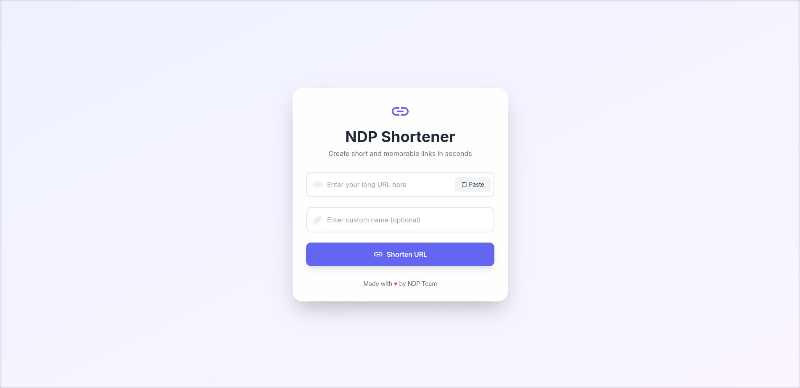

# NDP Shortener

Layanan pemendek URL modern, cepat, dan ramah pengguna yang dibangun dengan PHP, MySQL, dan antarmuka pengguna yang responsif.



## Fitur

- 🚀 Antarmuka pengguna modern dan responsif
- 🎨 Desain bersih dan intuitif dengan animasi
- 📋 Fungsi tempel URL (paste)
- ✨ Dukungan URL kustom
- 🔄 Validasi real-time
- 📱 Desain ramah seluler
- 🐳 Dukungan Docker untuk deployment mudah
- 🔧 Manajemen database mudah dengan Adminer

## Teknologi yang Digunakan

- Frontend: HTML, CSS (Tailwind CSS), JavaScript
- Backend: PHP 8.0
- Database: MariaDB 10.6
- Container: Docker & Docker Compose
- Tambahan: Adminer untuk manajemen database

## Prasyarat

- Docker dan Docker Compose terinstal di sistem Anda
- Git (opsional, untuk mengkloning repositori)

## Cara Instalasi

1. Kloning repositori:

```bash
git clone https://github.com/NDP4/sortener-web.git
cd sortener-web
```

2. Konfigurasi variabel lingkungan di `docker-compose.yml`:

```yaml
- MYSQL_DATABASE=your-database
- MYSQL_USER=your-user
- MYSQL_PASSWORD=your-password
- MYSQL_ROOT_PASSWORD=your-root-password
```

3. Bangun dan jalankan container:

```bash
docker-compose up -d
```

Aplikasi akan tersedia di:

- Pemendek URL: http://localhost:6004
- Adminer (Manajemen Database): http://localhost:4004

## Cara Penggunaan

1. **Memendekkan URL:**

   - Masukkan URL panjang ke dalam kolom input
   - Opsional, tambahkan nama kustom untuk URL pendek Anda
   - Klik "Shorten URL"

2. **URL Kustom:**

   - Masukkan nama kustom yang diinginkan di kolom "Custom name"
   - Hanya huruf, angka, tanda hubung, dan garis bawah yang diperbolehkan

3. **Menyalin URL Pendek:**

   - Klik tombol "Copy URL" untuk menyalin URL pendek
   - Notifikasi akan muncul saat berhasil disalin

4. **Manajemen Database:**
   - Akses Adminer di http://localhost:4004
   - Login menggunakan kredensial database Anda
   - Server default: `db`

## Pengembangan

Untuk melakukan perubahan pada proyek:

1. Modifikasi file di direktori masing-masing:

   - Frontend: `index.html`, `script.js`
   - Styling: Perbarui kelas Tailwind langsung di HTML
   - Backend: `index.php`
   - Database: Akses melalui Adminer

2. Perubahan akan langsung terlihat karena volume mounting

## Struktur Proyek

```
sortener-web/
├── Dockerfile
├── docker-compose.yml
├── .htaccess
├── index.php
├── index.html
└── script.js
```

## Kontribusi

1. Fork repositori
2. Buat branch fitur (`git checkout -b fitur/fitur-keren`)
3. Commit perubahan Anda (`git commit -m 'Menambahkan fitur keren'`)
4. Push ke branch (`git push origin fitur/fitur-keren`)
5. Buat Pull Request

## Lisensi

Proyek ini dilisensikan di bawah Lisensi MIT - lihat file LICENSE untuk detail.

## Pembuat

**Tim NDP** - [Profil GitHub](https://github.com/NDP4)

## Dukungan

Jika Anda menemui masalah atau memiliki pertanyaan, silakan [buat issue](https://github.com/NDP4/sortener-web/issues).

---

Dibuat dengan ♥ oleh Tim NDP
